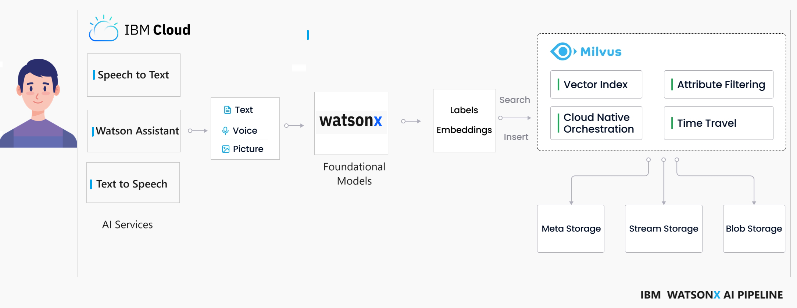
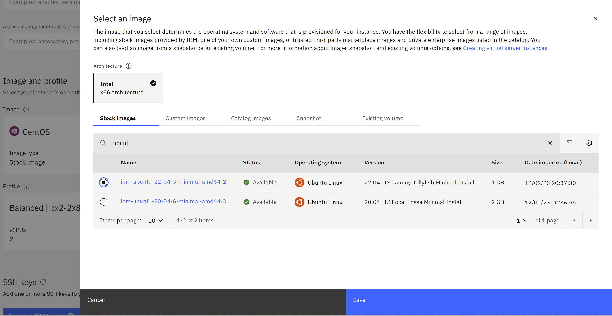
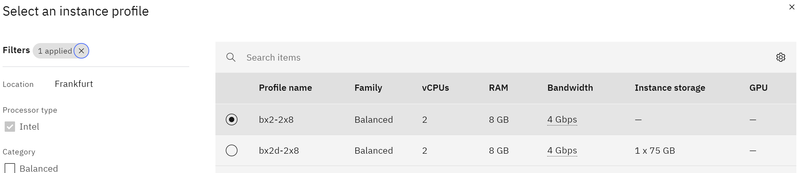
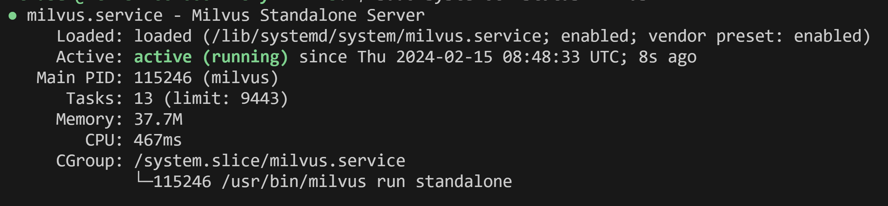
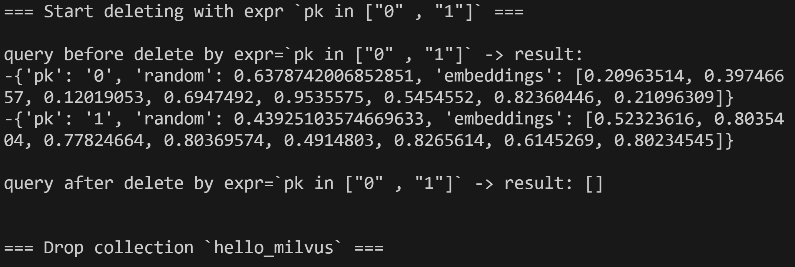

# Watsonx Assistant with Milvus as Vector Database

Hello everyone, today We are going to build a WatsonX Assistant with Milvus as Vector Database. 

# Introduction 




In this blog, we will explore the development of a  WatsonX Assistant that can engage in voice interactions and deliver responses using synthetic speech from Watsonx.ai within a Vector Database. This innovative solution harnesses the power of the latest artificial intelligence models, for retrieving questions. Specifically, we will delve into the integration of a Milvus Vector Database within a healthcare use case, creating a virtual assistant doctor for an enhanced patient experience.

Milvus is a database designed to store, index, and manage massive embedding vectors generated by deep neural networks and other machine learning models. It is capable of indexing vectors on a trillion scale and is built to handle embedding vectors converted from unstructured data, which has become increasingly common with the growth of the internet. 

By calculating similarity distances between vectors, WatsonX.ai's Foundation Model analyzes the questions using the Augmented Knowledge Base created by Milvus. This process allows for the examination of correlations between original data sources. In our specific case, we have numerous questions and answers, and our goal is to identify the best answer for each given question.

# Setup 

## Step 1 - Creation of the Virtual Server

First we need to install our Vector Database. The sytem where we want to deploy our database is Ubuntu 22.04.
1. Log in to your IBM Cloud account [here](https://cloud.ibm.com/).
2. From the IBM Cloud dashboard, click on the "Catalog" tab.
3. In the search bar, type `Virtual Servers` and select the "Virtual Servers" option from the results.
4. On the Virtual Servers page, you will find various options for virtual servers. 
Got to Image and Profile and click Change image and find for ubuntu and we choose 
`22.04 LTS Jammy Jellyfish Minimal Install` and click save

5. Click on the chosen virtual server option to start configuring it.
6. On the configuration page, you will be prompted to provide various details like the location, CPU, memory, storage, and operating system. We choose the simplest `bx2-2x8`

7. We create a ssh key with the name pem_ibmcloud and we download.
8.  Complete the remaining configuration options as default, storage options and network settings with exception of adding a port open to connect it.
9. Once you have configured the instance, review the settings and click on the "Create" button to create the instance.
10. IBM Cloud will initiate the provisioning process, and your Ubuntu instance will be created.
Copy the public ip of you virtual instance.

## Step 2 - Connection to the server

Open an SSH client.

Locate your private key file. The key used to launch this instance is private-key.pem
Run this command, if necessary, to ensure your key is not publicly viewable.
```
chmod 400 "private-key.pem"
```

Connect to your instance using its Public ip:

Example:
```
ssh -p 2223 -i private-key.pem itzuser@158.175.181.145
```

## Step 3 - Install Milvus

Install Milvus with dpkg on Ubuntu
$ wget https://github.com/milvus-io/milvus/releases/download/v2.3.7/milvus_2.3.7-1_amd64.deb

```
sudo apt-get update
sudo dpkg -i milvus_2.3.7-1_amd64.deb
sudo apt-get -f install
```
## Check the status of Milvus

First you restart, 
```
sudo systemctl restart milvus
```
there is not expected out, and then

```
sudo systemctl status milvus

```


### Testing Server

First we assure that python3 is installed
Add the deadsnakes PPA (might have Python 3.10)
```
sudo add-apt-repository -y ppa:deadsnakes/ppa
```
# Update package list again
```
sudo apt-get update
```
 Install Python 3.10
```
sudo apt-get install -y python3.10
sudo apt-get install -y python-pip
sudo apt-get install python-is-python3
```
# Verify installation
python --version
We install some packages to test 
```
pip install numpy pymilvus 
```
Download hello_milvus.py directly or with the following command.
```
wget https://raw.githubusercontent.com/milvus-io/pymilvus/master/examples/hello_milvus.py

```
and then we proceed with the following actions
 1. connect to Milvus
 2. create collection
 3. insert data
 4. create index
 5. search, query, and hybrid search on entities
 6. delete entities by PK
 7. drop collection

you can visulaze the code [here](https://raw.githubusercontent.com/milvus-io/pymilvus/master/examples/hello_milvus.py)

```
python hello_milvus.py
```
the output is:



## Port checking
Finaly, we are interested to execute this application by usin the port `19530`.

To check if port `19530` is open on your server, you can use a port scanning tool like `nmap` or `telnet`. Here are the steps to check the port status:
Use the `telnet` command to check the port status. Run the following command in the terminal  in the Server:
```
telnet <server_ip_address> 19530
```
Replace `<server_ip_address>` with the actual IP address of your server. If the port is open, you will see a connection established. If the port is closed or not reachable, the connection will fail.

If you are unable to perform these checks  you  should open the inboud port of the server, you can add the source the server where you will use to make the query.


# Milvus Embedding Client

Let first check if our Server can be connected remotelly.
Let deep dive the question Answering Demo Test [here](notebooks/README.md)
# Creation the Assistant
Once our Vector Database is running, we can continue to create our Assitant.
First let us create our backend pipeline [here](backend/README.md)