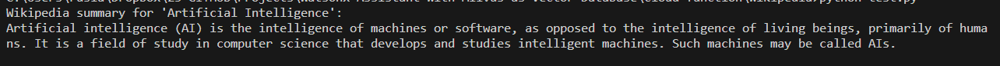

# Serverless Cloud Function Example - Wikipedia

First we enter the directory of wikipedia
### Build the Docker image:
```
docker build -t my-cloud-function .
```
### Run the container:

```
docker run -p 8080:8080 my-cloud-function
```

### How to use
Send a POST request to http://localhost:8080/cloud-function with the following JSON data:

```JSON
{
  "object_of_interest": "Gravity"
}
```

The server will respond with a JSON object containing the extracted Wikipedia summary for "Gravity".

This is just a basic example, and you can customize the code further based on your specific needs. For example, you could add error handling, authentication, and additional features to your cloud function.

## Local test
You can just test the app.py by typing
```
flask run -h 0.0.0.0 -p 8080
```
then you can execute

```
python test.py
```
and you will get 


so this local function is working.
Additional test might done [here](test.md)

