# Code Engine Application

In ordering to run our API for WatsonX.ai we need to create a serverless application.

We can use Code Engine as example to run our application.

# By using the Console
First we go to Secrets and configmaps
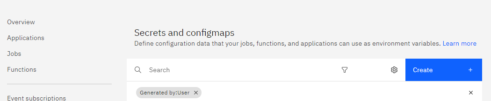

We create a `docker-hub-secrets` where we indicate our credentials to acces to our docker server. 
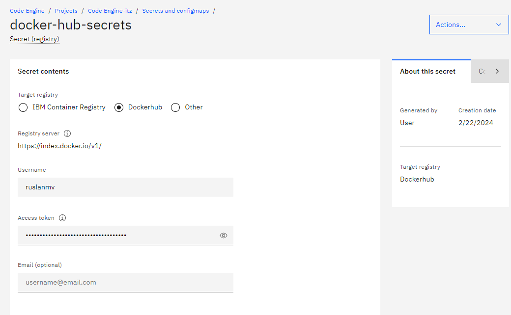
Additionally we need to define the `Secret (generic)`
we we define our secrets keys used for the  enviroment in the docker container
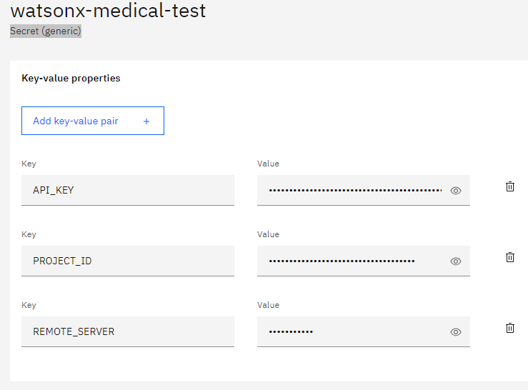


Finally we can create an application
we choose the `Container image`  we give a name like for example `watsonx-medical`  


and we click configure image, and we full fill with our previos `docker-hubs-secrets created` before

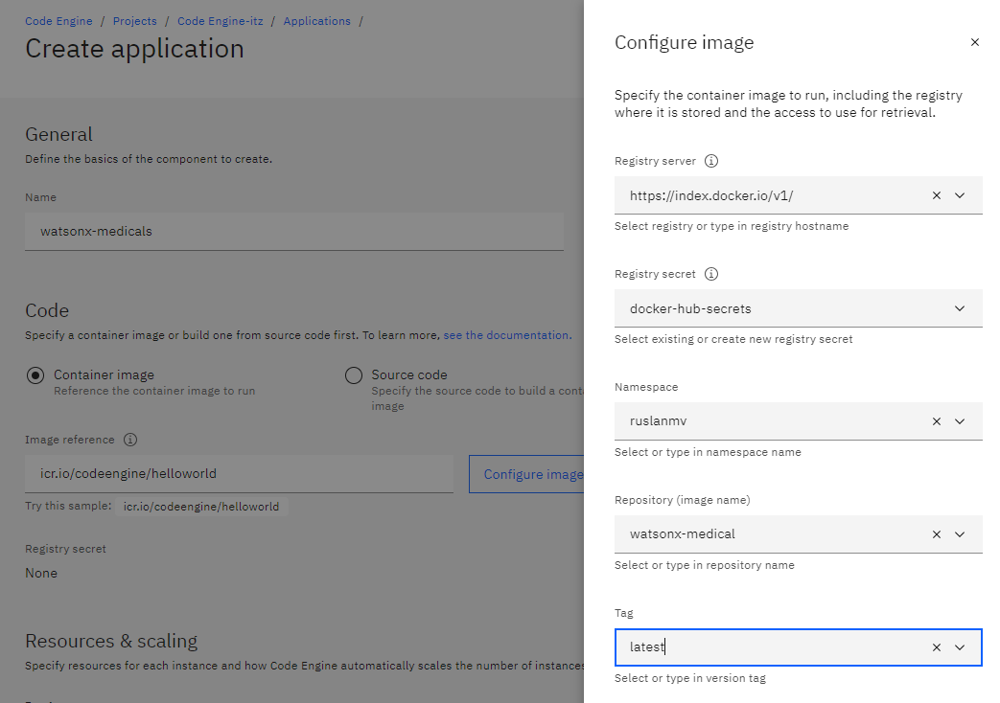


For rersource and scaling we use
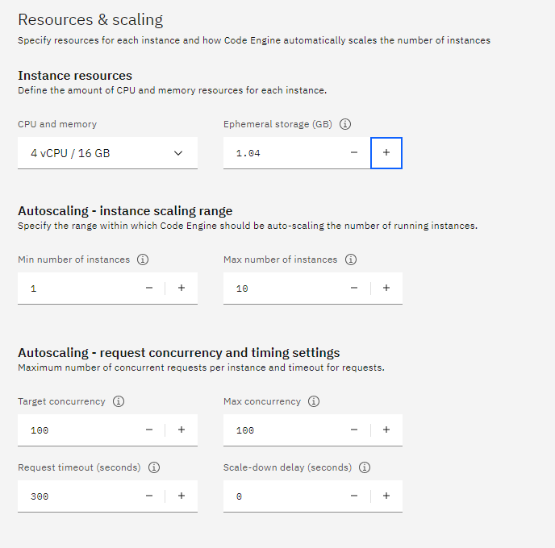

It is important that our application should have 16 gb of ram and also min number of instances 1, becasue it load the model of encoding, if becomes zero should start download from zero.

Then we add the enviroment variables just created
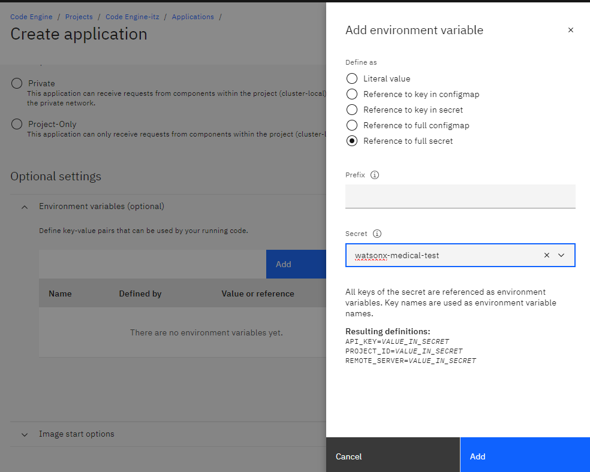

then we add the listeing port `7860`
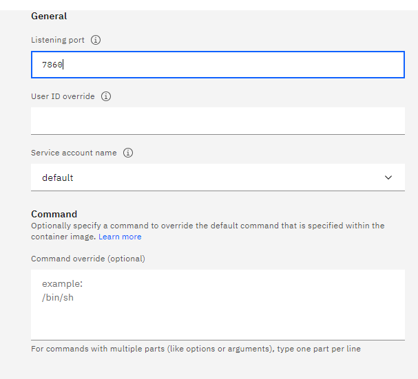


And finally click in create
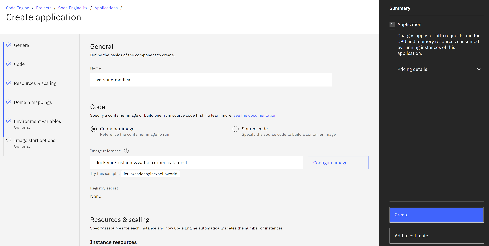
Then we can see the app is deployed and running
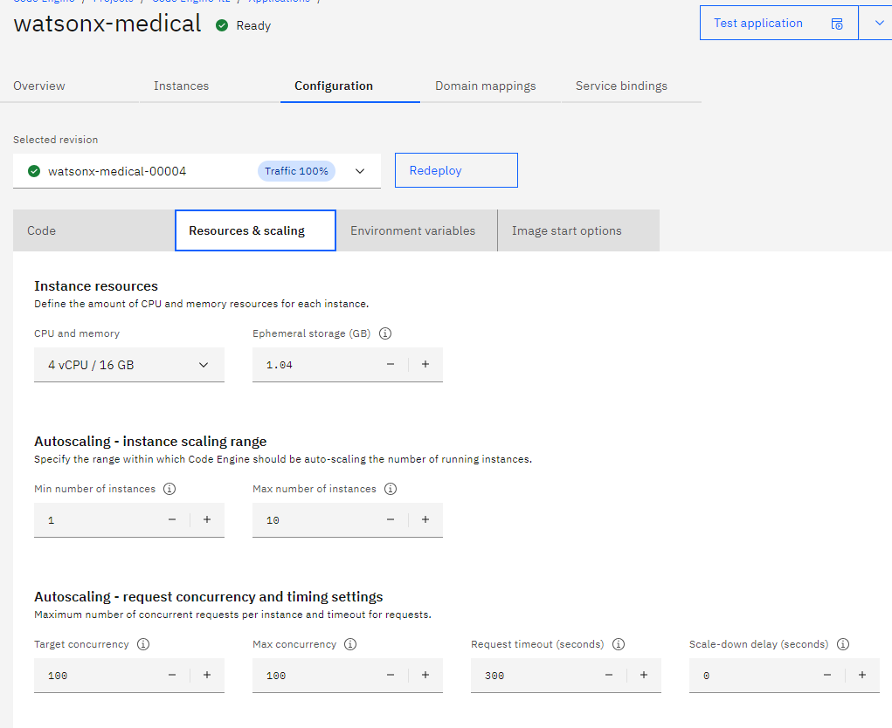

Once the application is created and deployes we can check our Image that was to run


Finally we can make questions to our Medical Bot
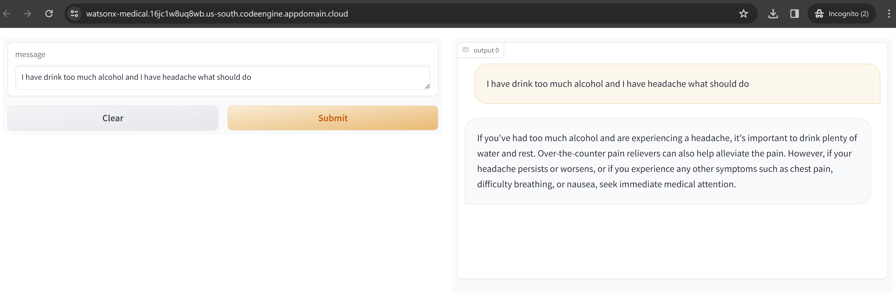

# By using IBM CLI

Step 1 - Connect bucket to Code Engine Application
Login to Code Engine First we need to login to our account that has the Code Engine enabeled.

```
ibmcloud login -sso
```

Install the IBM Cloud Code Engine plugin:

```
ibmcloud plugin install code-engine
```
Choose the resource group targeted. 
For example you can retrieve it by clicking Manage > Account > Resource groups

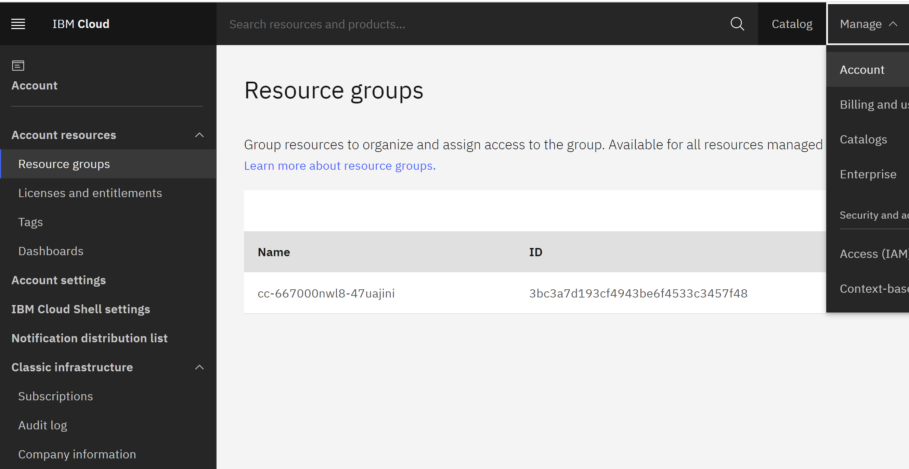


Run `ibmcloud target -g RESOURCE_GROUP_NAME`, for example

```
ibmcloud target -g 7a2041499b7141feac3a2beac59b8b80

```

First, list the available regions using the following command:
```
ibmcloud regions
```
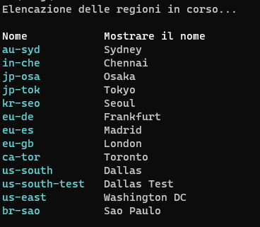
This command will display a list of available regions and their respective endpoints.

Next, set the desired region using the `ibmcloud target` command with the `--region` flag. Replace `<region>` with the desired region from the list of available regions:
```
ibmcloud target --region <region>
```
For example, to set the region to `us-south`, run:
```
ibmcloud target --r us-south
```

Confirm that the region has been changed by running the following command:
```
ibmcloud target
```
This command will display the current target region, organization, and space.


### Create a Code Engine project

```
ibmcloud ce project create --name watsonx-medical-project
```


Set the current project context

```
ibmcloud ce project select -n watsonx-medical-project
```


or also you can choose it by id


```
ibmcloud ce project select --id 349bb3bc-482a-4b6e-a226-e5ee6f29ef9c
```


We have to create the Registry Container

## For IBM Cloud Container
If you want to to load your container from the IBM Cloud you can type the following command


```
ibmcloud ce secret create --format registry --name watsonx-medical-registry --server icr.io --username iamapikey --password YOUR_API_KEY
```


## For Docker Container

If you want to load your Docker Container from Docker site, we setup the Docker credentials in the Code Engine

```
ibmcloud ce secret create --format registry --name my-docker-registry --server https://index.docker.io/v1/ --username YOUR_USERNAME --password YOUR_PASSWORD
```
### Secrets and configmaps
It is possible to use the ‘Secret’ object in Code Engine to store sensitive information for connection in a secure way.

```
ibmcloud code-engine secret create --name bucket-secret --from-env-file secrets.env
```

In the project’s dashboard navigate to ‘Secret and Configmap’ and create a Secret you will have something like

You can see the secret This will be store in a key:value format. 

After that it is possible to create the application and, in the environment variable section, connect the application to the secret. The application can now access the data with the standard API for environment variables.

Create the Code Engine application using the image from IBM Cloud Container Registry. To create an application in IBM Cloud Code Engine with the previously created secrets

### Create application from IBM Cloud Container
To create an application in IBM Cloud Code Engine using an image from IBM Cloud Container Registry and the previously created secrets, you can modify the command as follows:

```
ibmcloud code-engine application create --name watsonx-medical --image icr.io/watsonx-medical-namespace/watsonx-medical:latest --port 8501 --env-from-secret bucket-secret --registry-secret watsonx-medical-registry
```
In this command:


watsonx-medical is the name you want to give to your application.
`icr.io/watsonx-medical-namespace/watsonx-medical:latest` is the image reference for your application. The watsonx-medical-namespace is the namespace with the image tag latest .
8501 is the port on which your application will listen.

`--env-from-secret bucket-secret` specifies the secret you previously created (bucket-secret) to be used as environment variables for your application.

`--registry-secret watsonx-medical-registry` specifies the name of the registry secret watsonx-medical-registry that contains the credentials for accessing the container registry.
By providing the --registry-secret flag, you are ensuring that the necessary credentials are available to access the container registry where the image is stored.

Create Application from Docker
If you want to create the application form the Docker Container
```
ibmcloud code-engine application create --name watsonx-medical --image docker.io/ruslanmv/watsonx-medical:latest --port 8501 --env-from-secret bucket-secret --registry-secret my-docker-registry
```
After you typed the previous command you will get the following response 

In my case when you open your browser with the following url
```
https://watsonx-medical.1a6j02a995w8.us-south.codeengine.appdomain.cloud

```
The application will loading, after that you can upload a sample questions.txt, then you upload this file then it is processed. 

