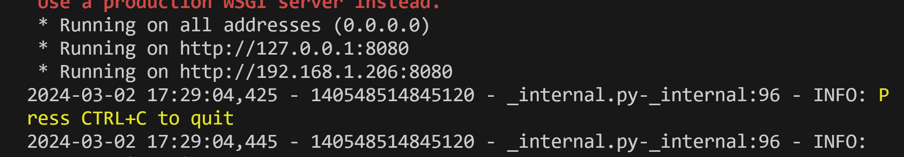
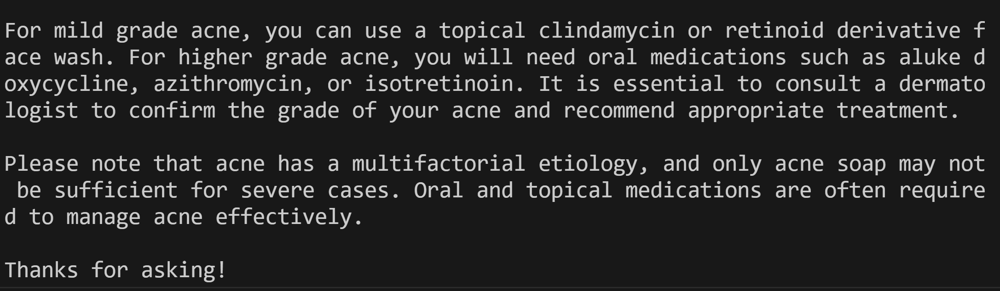
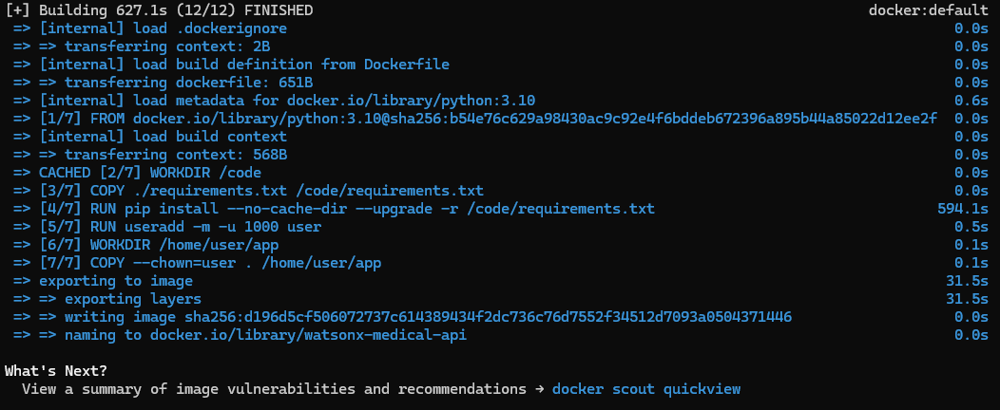
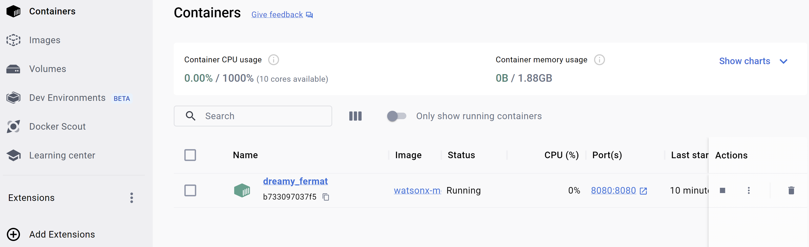
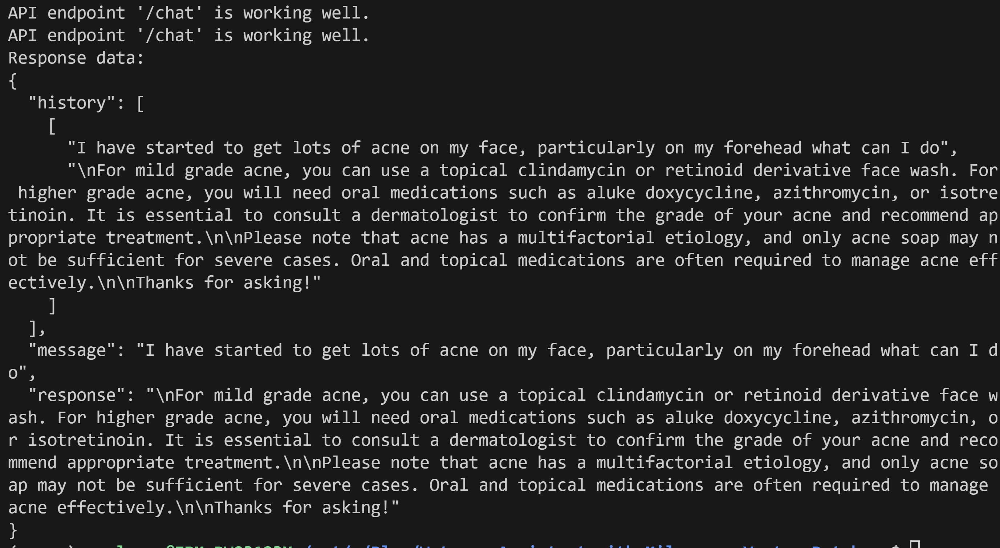

## WatsonX.ai container client question-answering application with Milvus and LangChain with Flask and OpenApi.
This guide demonstrates how to build an contiainer for client Watsonx.ai LLM-driven question-answering application with Milvus and LangChain
To run this application locally just we ran the following command:
 ```
 python app.py
 ```


## API Connection
### With Python

```python
import json
import requests

# Load the openapi.json file
with open('openapi.json', 'r') as file:
    openapi_data = json.load(file)

# Get the base URL of the API from the openapi.json file
base_url = openapi_data['servers'][0]['url']

# Define a function to test a specific API endpoint
def test_endpoint(endpoint, method, parameters=None, data=None):
    url = f"{base_url}{endpoint}"
    response = requests.request(method, url, params=parameters, json=data)
    if response.status_code == 200:
        print(f"API endpoint '{endpoint}' is working well.")
    else:
        print(f"API endpoint '{endpoint}' returned status code {response.status_code}.")

# Define a function to run a specific API endpoint
def run_endpoint(endpoint, method, parameters=None, data=None):
    url = f"{base_url}{endpoint}"
    response = requests.request(method, url, params=parameters, json=data)
    
    if response.status_code == 200:
        print(f"API endpoint '{endpoint}' is working well.")
    else:
        print(f"API endpoint '{endpoint}' returned status code {response.status_code}.")
    
    return response

# Define a function to test the API endpoint and print the results
def test_and_print_results(endpoint, method, data=None):
    response = run_endpoint(endpoint, method, data=data)
    
    if response.status_code == 200:
        response_data = response.json()
        print("Response data:")
        print(json.dumps(response_data, indent=2))
    else:
        print("Error occurred. No data to display.")

# Test the POST request on the /chat endpoint
example_endpoint = '/chat'
example_method = 'POST'
prompt = "I have started to get lots of acne on my face, particularly on my forehead what can I do"

example_data = {'message': prompt}

test_endpoint(example_endpoint, example_method, data=example_data)
test_and_print_results(example_endpoint, example_method, data=example_data)

```
 you will get
```
API endpoint '/chat' is working well.
API endpoint '/chat' is working well.
Response data:
{
  "history": [
    [
      "I have started to get lots of acne on my face, particularly on my forehead what can I do",
      "\nFor mild grade acne, you can use a topical clindamycin or retinoid derivative face wash. For higher grade acne, you will need oral medications such as aluke doxycycline, azithromycin, or isotretinoin. It is essential to consult a dermatologist to confirm the grade of your acne and recommend appropriate treatment.\n\nPlease note that acne has a multifactorial etiology, and only acne soap may not be sufficient for severe cases. Oral and topical medications are often required to manage acne effectively.\n\nThanks for asking!"
    ]
  ],
  "message": "I have started to get lots of acne on my face, particularly on my forehead what can I do",
  "response": "\nFor mild grade acne, you can use a topical clindamycin or retinoid derivative face wash. For higher grade acne, you will need oral medications such as aluke doxycycline, azithromycin, or isotretinoin. It is essential to consult a dermatologist to confirm the grade of your acne and recommend appropriate treatment.\n\nPlease note that acne has a multifactorial etiology, and only acne soap may not be sufficient for severe cases. Oral and topical medications are often required to manage acne effectively.\n\nThanks for asking!"
}
```
in the terminal also you get


## Container

To build and run the gradio application using the provided Dockerfile, follow these steps:
1. Ensure that you have Docker installed on your system.
2. Place the Dockerfile in the same directory as your gradio application code and the .env file.
3. Open a terminal or command prompt and navigate to the directory containing the Dockerfile.
4. Run the following command to build the Docker image, replacing "watsonx-medical-api" with your desired image name:
   ```bash
   docker build --no-cache -t watsonx-medical-api .
   ```

   This command will build the Docker image using the Dockerfile and the context of the current directory.
5. After successfully building the image, you can run the gradio application in a Docker container using the following command:

   ```bash
   docker run -it --env-file .env -p 8080:8080 watsonx-medical-api
   ```
During the previos execution You got 


   This command runs the Docker container, passing the environment variables from the .env file using the `--env-file` flag. It also maps the container's port 8080 to the host's port 8080, allowing you to access the gradio application through `http://localhost:8080`.

You can see the image created at Docker Desktop


and also your container



Moreover you can test the container local by running in the root directory the following command

```
python ./container-api/api-test.py
```

Please note that the provided instructions assume that your gradio application code is correctly configured to read the environment variables from the .env file.

```
REMOTE_SERVER=<milvus server>
API_KEY=<watsonx api key>
PROJECT_ID=<WatsonX project id>
```

If everythong went done well, just try with this prompt
```
I have started to get lots of acne on my face, particularly on my forehead what can I do
```




## Pushing your Docker image (optionally)

To push your Docker image to a repository, follow these steps:

1. Sign up for an account on Docker Hub (https://hub.docker.com/) if you haven't already.

2. Log in to Docker Hub on your local machine using the terminal or command prompt. Run the following command and enter your Docker Hub credentials when prompted:
```
docker login
```

3. Tag your local image with the repository name and a desired tag.  For example:
```
docker tag watsonx-medical-api ruslanmv/watsonx-medical-api:latest
```
Replace `ruslanmv` with your Docker Hub username. You can also choose a different tag instead of `latest` if you prefer.

4. Push the tagged image to Docker Hub using the `docker push` command. For example:
```
docker push ruslanmv/watsonx-medical-api:latest
```


5. After the push is completed, you can verify that the image is available in your Docker Hub repository by visiting https://hub.docker.com/ and checking your repositories.

Now, others can pull the image from the repository using the following command:
```
docker pull ruslanmv/watsonx-medical-api:latest
```
**Congratulations!** You could build and execute your Medical Chatbot with Flask within WatsonX and Milvus