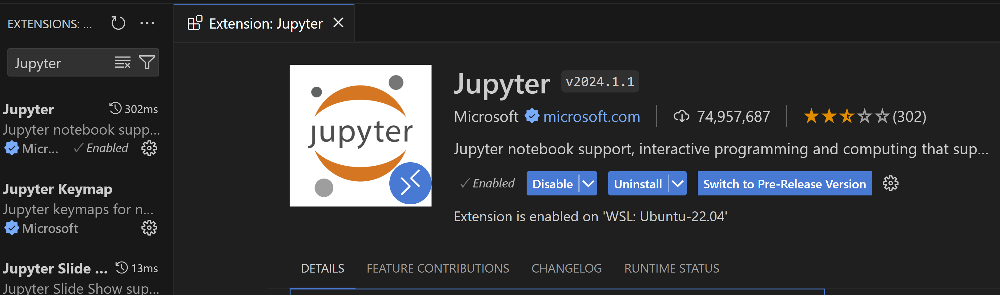
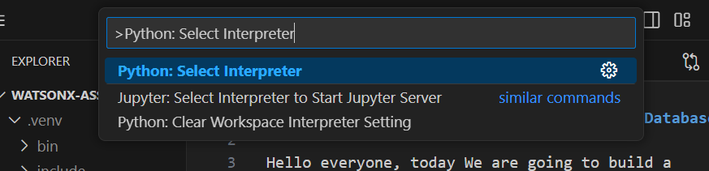
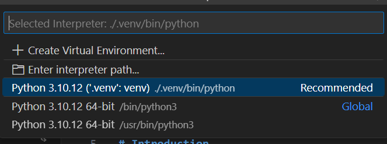

## Question Answering for Milvus
Question answering is a classic problem in the field of natural language processing. While it sounds like an easy problem to solve, there is still a lot of research going on to improve the techniques that we have now. A large part of solving questions is finding questions that are similar to the one being asked.

## Setup Enviroment
You can use Google Colab or Simply run localy.

In Windows we use Ubuntu WSL 2.0 

```
bash
```
then 
```
python3 -m venv .venv
```
we activate it
```
source .venv/bin/activate
```
we dopwnlod the requirements
```
wget https://raw.githubusercontent.com/ruslanmv/Watsonx-Assistant-with-Milvus-as-Vector-Database/master/requirements.txt

```
then we install it

```
pip install -r requirements.txt
```
then if you are in bash, 
1. Open Visual Studio Code.

```
code .
```
2. We install the followig `Jupyter` extension
   

3. Press `Ctrl + Shift + P` (or `Cmd + Shift + P` on macOS) to open the command palette.
4. Type `Python: Select Interpreter` in the command palette and select it.
   
5. A list of available Python interpreters will appear. Scroll down or use the search box to find the WSL Ubuntu interpreter.


## Question Answering Notebook

This example will show you how to find the similar asked question and get the answer.

[](./1_build_question_answering_engine.ipynb)

Then repeat the previos step by selecting Select Kernel 

and now we can proceed with the notebook.