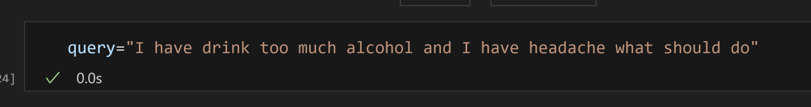
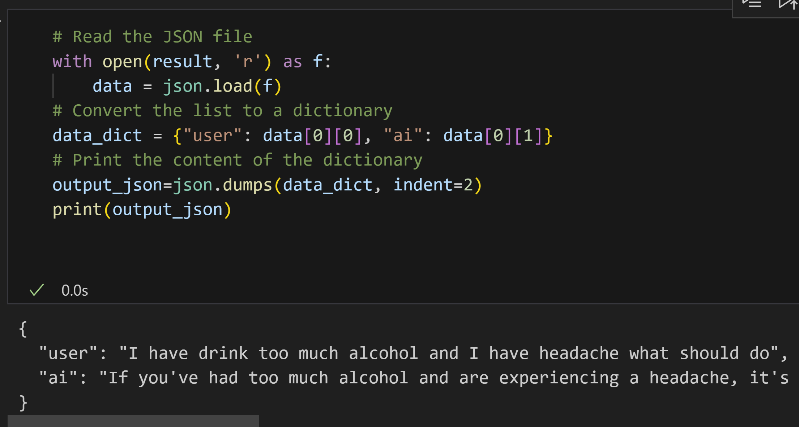
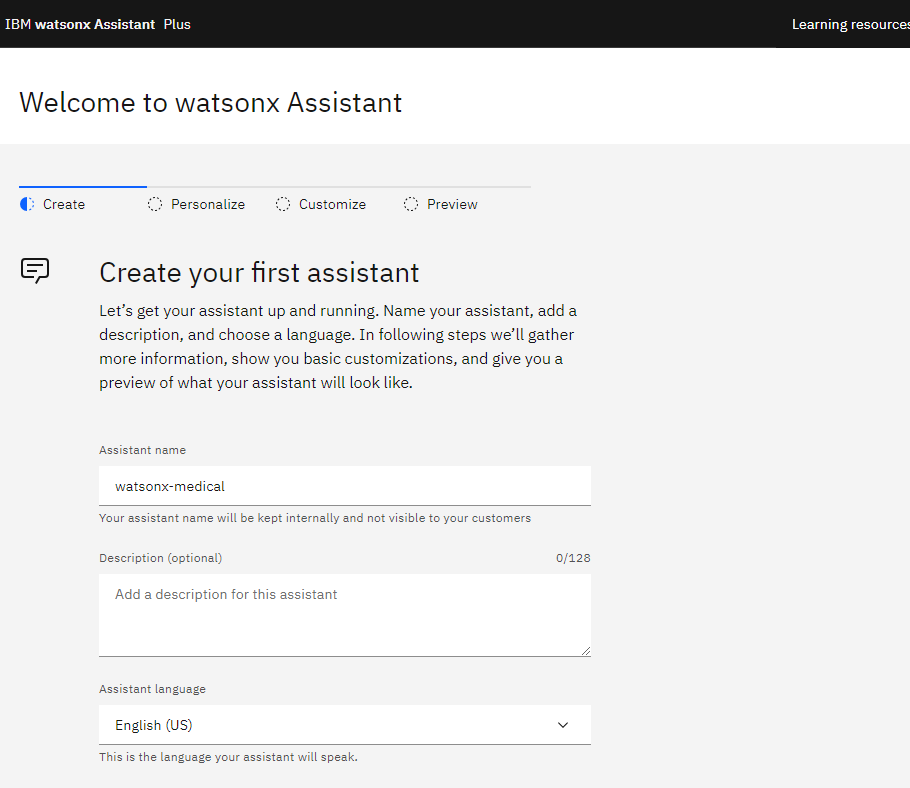

# Watson Assistant with WatsonX Medical

First let us create a simple notebook to just test our API, if is working. We would like use Jupyter Notebook in Visual Studio Code.
To create a new Jupyter Notebook in Visual Studio Code check it out [this](./setup-notebook.md)
Now you have created and started working on a new Jupyter Notebook in Visual Studio Code.
In particular we have created for you this notebook of test here
[API-Test-WatsonX.ipynb](./API-Test-WatsonX.ipynb)
For example having this query

you will get something like this

For the benchmarking we executed different questions  on local and in the cloud
on the Code Engine and we got the following results:

As you see our cloud version fortunatelly is working better that locally.
## Watson Assistant Setup

First we create our watson assitant
