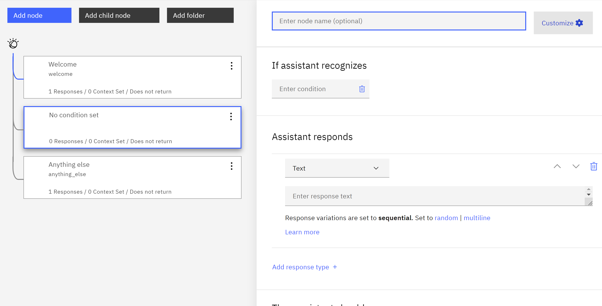
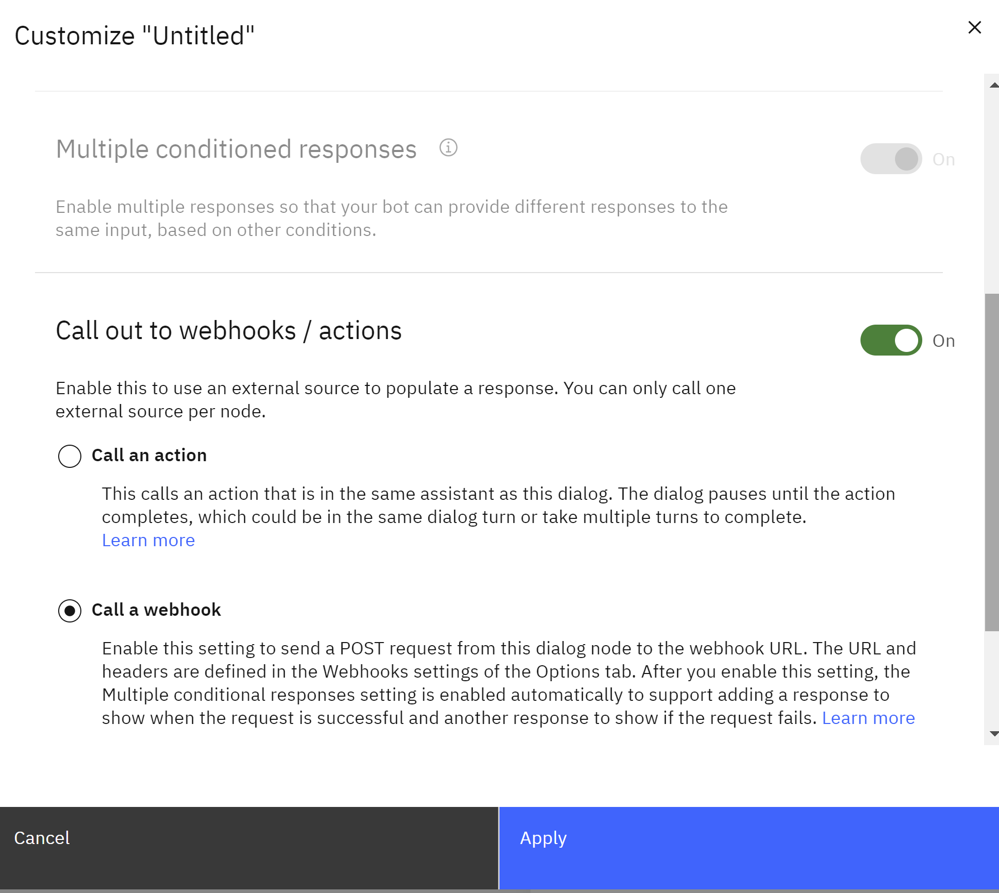
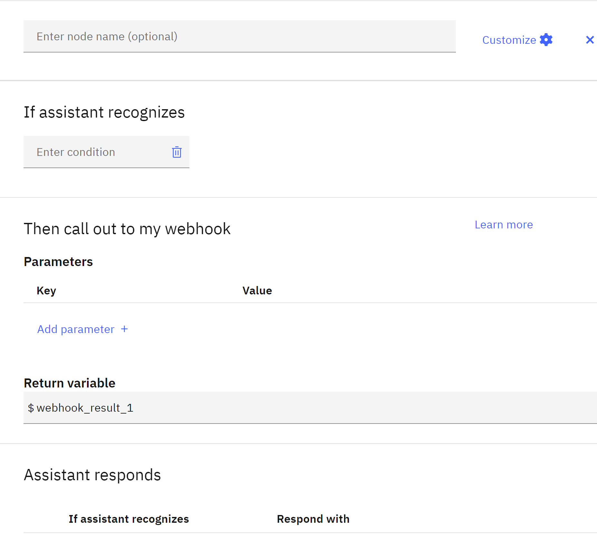
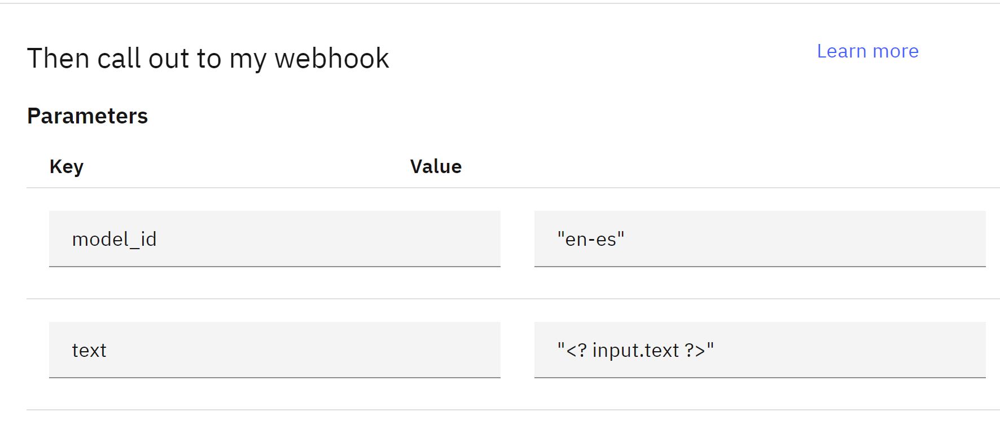

## Building a Watson Assistant with a Webhook for Translation

This guide expands on the previous explanation, providing details on calling a webhook in the dialog menu to translate user input using the Watson Language Translator service.

**Prerequisites:**

* An IBM Cloud account
* Access to the Watson Assistant service
* A Watson Language Translator service instance

**Steps:**

**1. Define the Webhook:**

1. Navigate to your Watson Assistant service ancd create  Assistant.
2. Then go to Assistant settings and click Activate dialog 
3. Under the "Dialog" tab, go to Options and click on "Webhooks" located on the left sidebar.
4. Enter the URL of the Watson Language Translator service endpoint: `https://api.us-south.language-translator.watson.cloud.ibm.com/v3/translate?version=2018-05-01`
- In the "Headers" section, add a header named "Content-Type" with the value "application/json" to specify the request format.

**2. Add a Webhook Callout to a Dialog Node:**

1. Open te dialog and create dialog.
2. Create a new node by clicking add new node, and  the dialog node where you want to trigger the translation.
3. Click "Customize" on the right corner of the node.
   
4. Scroll down to the "Webhook" section and toggle "Call out to webhooks/actions" to **On**.

5. Select "Call a webhook" and click **Apply**.
and you got

**3. Configure the Webhook Request:**

1. **In the "Parameters" section:**
    - Add a key-value pair:
        - **Key:** "model_id"
        - **Value:** "en-es" (replace "en-es" with your desired translation language code, e.g., "es-fr" for Spanish to French)
    - Add another key-value pair:
        - **Key:** "text"
        - **Value:** "<? input.text ?>" (this sends the user's input text to the service)

**4. Create Conditional Responses:**

1. Two response conditions are automatically added:
    - **Success:** This response is displayed if the translator returns a valid translation.
    - **Failure:** This response is displayed if the call fails.
2. Edit the "Success" response to include:
    - `<return-variable>.translations[0].translation>` (this extracts the translated text from the webhook response).
3. Customize the "Failure" response as needed.

**5. Example Usage and Run:**

1. Create a new dialog node where the user will enter text for translation.
2. In the node, capture the user's input in a context variable, for example, `$user_text`.
3. In the next node, trigger the webhook callout you configured. This node will receive the translated text in the `$webhook_result_1` variable.
4. In the response section of the translation node, use SpEL syntax to display the translated text to the user: `<return-variable>.translations[0].translation>`.
5. Test your Assistant by starting a conversation and entering text in the initial node. You should see the translated text displayed in the response.

**Additional Notes:**

* Remember to replace the example language code (`en-es`) with the desired translation language pair.
* Ensure your Watson Language Translator service has the necessary plan and billing enabled to handle your translation requests.
* Refer to the Watson Language Translator documentation for detailed information on available languages and options: [https://www.ibm.com/docs/en/openpages/9.0.0?topic=integrations-watson-language-translator](https://www.ibm.com/docs/en/openpages/9.0.0?topic=integrations-watson-language-translator)

This enhanced explanation provides a clearer understanding of how to configure the webhook, call the Watson Language Translator service, and include user input for translation within your Watson Assistant.

References:
https://cloud.ibm.com/docs/watson-assistant?topic=watson-assistant-dialog-webhooks
https://cloud.ibm.com/docs/assistant?topic=assistant-dialog-webhooks
https://cloud.ibm.com/docs/watson-assistant?topic=watson-assistant-webhook-overview